# Arquitectura de FiberLabRV — Hello Cardboard Scripts

Generado a partir de un análisis recursivo de:
`Assets/Samples/Google Cardboard XR Plugin for Unity/1.29.0/Hello Cardboard/Scripts`

## Inventario de scripts analizados (33 archivos)

```
Controllers/            AtenuadorController, BERTesterController, CameraLookController,
                         GameModeInitializer, GameModeManager, MainMenuController,
                         MenuNavigationController, MotionObjectController, PantallasBER,
                         PauseMenuController, TouchActionButton, TouchControlsBootstrap,
                         TouchInput, TouchJoystick, TouchLook
Debugger Testers/       PruebaBotones
HandsFocusMode/         EnfoqueInterfaces (FocusModeManager), FocusUIInputController,
                         Grabbable, HandInteraction, IFocusable
Iluminadores/           Iluminador3D (Highlightable), IluminadorUI (UIHighlightable)
InstructionManagers/    InstructionManager_Demo, PracticaSwitcher
Practica1/               P1_BufferIdentity, P1_CablePart, P1_FiberIdentity, P1_Instrucciones
Practica3/                ConexionFibra (CableEnd), ConnectableDevice, ConnectionMenuUI,
                         DeteccionConexion (CableSocket), InstructionManager_P3
                         (InstructionManagerPrac3), LinkStateManager
```

**Notas importantes sobre nombres de archivo vs. nombres de clase:**
- La clase `InstructionManagerPrac3` vive en el archivo `Practica3/InstructionManager_P3.cs`.
- La clase `FocusModeManager` vive en el archivo `HandsFocusMode/EnfoqueInterfaces.cs`.
- La clase `OpticalAttenuatorController` vive en el archivo `Controllers/AtenuadorController.cs`.
- La clase `InstrumentUIScreenManager` vive en el archivo `Controllers/PantallasBER.cs`.

**Scripts que existían pero ya no están en disco** (borrados en el working tree, pendientes de commit en git — no se incluyen en los diagramas por decisión del autor):
`Controllers/OTDRController.cs`, `InstructionManagers/P1_BufferMenu.cs`, `InstructionManagers/P1_GlobalCalcPanel.cs`. No se encontró rastro de `OTDRData.cs` en ningún punto del historial de git bajo ese nombre.

`Debugger Testers/PruebaBotones.cs` (clase `JoystickDebugRaw`) es un script de depuración de input sin relación estructural con el resto — se omite de los diagramas.

---

## Diagrama de clases

```mermaid
classDiagram
    %% ══════════════ INTERFAZ COMPARTIDA ══════════════
    class IFocusable {
        <<interface>>
        +OpenFocus()
    }

    %% ══════════════ FOCUS MODE — compartido entre Práctica 3 y navegación general ══════════════
    class FocusModeManager {
        <<singleton>>
        +Instance$
        +IsInFocusMode
        +Enter(uiToShow)
        +Exit()
    }
    class FocusUIInputController {
        +submitButton
        +cancelButton
        +HandleNavigation()
        +HandleSubmitCancel()
    }
    class HandInteraction {
        <<singleton>>
        +Instance$
        +OnGrab$
        +OnRelease$
        +ReticleOverride$
        +cableTensionReached$
        +BotonAgarrar
        +BotonInteractuar
        +TryGrab()
        +Grab()
        +DropAndPlace()
        +TryOpenFocusMode()
        +ConnectCableToSocket()
    }

    %% ══════════════ RESALTADO — compartido en todo el proyecto ══════════════
    class Highlightable {
        +highlightColor
        +Highlight(bool)
        +GrayOut(bool)
    }
    class UIHighlightable {
        +highlightColor
        +Highlight(bool)
    }
    class Grabbable {
        +id
    }
    class GrabbableID {
        <<enumeration>>
        Null
        Atenuador
        Patchcord
    }

    %% ══════════════ CONEXIÓN DE CABLES — compartido, usado por Demo y Práctica 3 ══════════════
    class CableEnd {
        +connectedSocket
        +otherEnd
        +ConnectToSocket(socket)
        +Disconnect()
        +ResetToStart()
    }
    class CableSocket {
        +socketType
        +occupied
        +connectedCable
        +Connect(cable)
        +Disconnect()
    }
    class SocketType {
        <<enumeration>>
        TxOutput
        AtenuadorInput
        AtenuadorOutput
        RxInput
    }
    class ConnectableDevice {
        +deviceName
        +ports
        +GetAvailablePorts()
        +HasAvailablePorts()
    }
    class ConnectionMenuUI {
        <<singleton>>
        +Instance$
        +IsOpen
        +Show()
        +Close()
    }

    %% ══════════════ INPUT / TOUCH — compartido (Modo Normal) ══════════════
    class GameModeManager {
        <<static>>
        +IsVRMode$
    }
    class TouchInput {
        <<static>>
        +ButtonDown()$
    }
    class TouchActionButton {
        +Pressed$
        +PressId$
        +Exists$
    }
    class TouchControlsBootstrap {
        +Awake()
    }
    class TouchJoystick {
        +MoveInput$
    }
    class TouchLook {
        +LookInput$
    }
    class GameModeInitializer {
        +Start()
    }
    class CameraLookController {
        +sensitivity
    }
    class MotionObjectController {
        +moveSpeed
        +jumpHeight
    }
    class MainMenuController {
        +EnterVRMode()
        +EnterNormalMode()
    }
    class MenuNavigationController {
        +activePanels
    }
    class PauseMenuController {
        +pauseKey
        +TogglePause()
        +Resume()
        +GoToMainMenu()
    }

    %% ══════════════ ORQUESTACIÓN DE PRÁCTICAS ══════════════
    class PracticaSwitcher {
        <<singleton>>
        +Instance$
        +instruccionesP1
        +instruccionesP3
        +instruccionesDemo
        +ActivarPractica()
    }
    class InstructionManager_Demo {
        +cableEnd1
        +cableEnd2
        +RunDemo()
    }

    %% ══════════════ PRÁCTICA 1 — Identificación TIA/EIA-598-C ══════════════
    class P1_InstructionManager {
        <<singleton>>
        +Instance$
        +escenaCuestionario
        +supabaseConfig
        +RunStep0_AcercateMesa()
        +RunStep7_Checkout()
        +EnviarResultadoASupabase()
    }
    class P1_CablePart {
        +partType
        +SetHovered(bool)
    }
    class CablePartType {
        <<enumeration>>
        Vaina
        Armadura
        CintaMilar
        Nucleo
    }
    class P1_BufferIdentity {
        +bufferIndex
    }
    class P1_FiberIdentity {
        +bufferIndex
        +fiberPosition
    }

    %% ══════════════ PRÁCTICA 3 — Enlace óptico / BER ══════════════
    class InstructionManagerPrac3 {
        <<singleton>>
        +Instance$
        +allowFocusMode
        +nombreEscenaCuestionario
        +NextStep()
        +HandleBERStarted()
        +HandleAtenuadorStarted()
    }
    class LinkStateManager {
        <<singleton>>
        +Instance$
        +CurrentScenario
        +OnScenarioChanged$
        +GetCurrentData()
        +HasLink()
    }
    class LinkScenario {
        <<enumeration>>
        Disconnected
        Nominal
        Degraded
        Critical
    }
    class BERTesterController {
        +OpenBERTester()
        +StartBERTest()
        +StartQuickTest()
        +ExitBERTester()
    }
    class OpticalAttenuatorController {
        +CurrentWavelength
        +CurrentPower
        +IsOn
        +OpenFocus()
        +ButtonA_Power()
        +ButtonD_Up()
        +ButtonG_Down()
        +ExitInstrument()
    }
    class InstrumentUIScreenManager {
        +ShowHome()
        +ShowConfig()
        +ShowBERTest()
        +ShowInfo()
        +TurnOnOffBERTester()
    }

    %% ══════════════ RELACIONES ══════════════
    BERTesterController ..|> IFocusable
    OpticalAttenuatorController ..|> IFocusable

    FocusModeManager --> HandInteraction : deshabilita/rehabilita
    FocusModeManager --> MotionObjectController : deshabilita/rehabilita
    FocusUIInputController --> FocusModeManager : Exit()

    HandInteraction --> Grabbable : detecta al agarrar
    HandInteraction --> CableEnd : mueve/conecta
    HandInteraction --> CableSocket : valida conexión
    HandInteraction --> ConnectableDevice : consulta puertos
    HandInteraction --> ConnectionMenuUI : abre selección de puerto
    HandInteraction --> BERTesterController : TryOpenFocusMode()
    HandInteraction --> OpticalAttenuatorController : TryOpenFocusMode()
    HandInteraction --> InstructionManagerPrac3 : consulta allowFocusMode

    CableEnd --> CableSocket : connectedSocket
    CableSocket --> CableEnd : connectedCable
    ConnectionMenuUI --> ConnectableDevice
    ConnectionMenuUI --> CableEnd
    ConnectionMenuUI --> CableSocket

    TouchControlsBootstrap --> TouchJoystick : instancia
    TouchControlsBootstrap --> TouchLook : instancia
    TouchControlsBootstrap --> TouchActionButton : instancia
    TouchInput --> TouchActionButton
    TouchInput --> GameModeManager
    MotionObjectController --> TouchJoystick : MoveInput
    MotionObjectController --> HandInteraction : cableTensionReached
    CameraLookController --> TouchLook : LookInput
    GameModeInitializer --> GameModeManager
    GameModeInitializer --> CameraLookController
    MainMenuController --> GameModeManager
    MenuNavigationController --> TouchInput

    PracticaSwitcher o-- P1_InstructionManager
    PracticaSwitcher o-- InstructionManagerPrac3
    PracticaSwitcher o-- InstructionManager_Demo
    InstructionManager_Demo --> CableEnd : cableEnd1 / cableEnd2
    InstructionManager_Demo --> LinkStateManager : consulta escenario
    InstructionManager_Demo --> PracticaSwitcher : ActivarPractica()

    P1_InstructionManager --> Highlightable
    P1_InstructionManager --> P1_CablePart
    P1_InstructionManager --> P1_BufferIdentity
    P1_InstructionManager --> P1_FiberIdentity
    P1_CablePart --> CablePartType

    InstructionManagerPrac3 --> BERTesterController : suscribe eventos
    InstructionManagerPrac3 --> OpticalAttenuatorController : suscribe eventos
    InstructionManagerPrac3 --> LinkStateManager : suscribe OnScenarioChanged
    InstructionManagerPrac3 --> Highlightable
    LinkStateManager --> CableSocket : 4 sockets del enlace
    LinkStateManager --> OpticalAttenuatorController : lee atenuación
    BERTesterController --> LinkStateManager : GetCurrentData()
    BERTesterController --> FocusModeManager : Enter/Exit
    OpticalAttenuatorController --> FocusModeManager : Enter/Exit
    BERTesterController --> InstrumentUIScreenManager : navega pantallas
```



---

## Diagrama de arquitectura / componentes

```mermaid
flowchart TB
    subgraph EXTERNO["Fuera del análisis (otros paths del proyecto)"]
        direction TB
        SB[("Supabase\n(REST API)")]
        SUPCFG["SupabaseConfig\n(Assets/Scripts/Shared)"]
        SESSION["SessionManager / SceneGuard\n(Assets/Scripts/Auth)"]
        QFINAL["QuestionarioPage / QuestionarioFinal\n(Assets/Scripts/Questionnaire)"]
        SATGATE["SatisfaccionGate\n(Assets/Scripts/Network)"]
        CUESTSCENES["Escenas CuestionarioPracX\n(x-1, x-2, x-3)"]
        FEEDBACKSCENE["Escena Feedback"]
        ENVIOSCENE["Escena EnvioExitoso"]
    end

    subgraph MENU["Escena MenuPrincipal"]
        MMC["MainMenuController"]
        GMM["GameModeManager (static)"]
        MMC --> GMM
    end

    subgraph PRACSCENE["Escena única PracticasRV.unity (Práctica1 + Práctica3 + Demo)"]
        direction TB

        PSW["PracticaSwitcher (singleton)"]

        subgraph INPUT["Capa de input (Modo Normal / VR)"]
            TCB["TouchControlsBootstrap"]
            TJ["TouchJoystick"]
            TL["TouchLook"]
            TAB["TouchActionButton"]
            TI["TouchInput (static)"]
            MOC["MotionObjectController"]
            CLC["CameraLookController"]
            GMI["GameModeInitializer"]
            TCB --> TJ
            TCB --> TL
            TCB --> TAB
            TI --> TAB
            MOC --> TJ
            CLC --> TL
            GMI --> GMM
        end

        subgraph SHARED["Sistemas compartidos"]
            HI["HandInteraction (singleton)"]
            FMM["FocusModeManager (singleton)"]
            FUIC["FocusUIInputController"]
            HL["Highlightable / UIHighlightable"]
            CE["CableEnd"]
            CS["CableSocket"]
            CD["ConnectableDevice"]
            CMU["ConnectionMenuUI (singleton)"]
            HI --> FMM
            HI --> CE
            HI --> CS
            HI --> CMU
            FUIC --> FMM
            CE --> CS
        end

        DEMO["InstructionManager_Demo"]

        subgraph P1["Práctica 1 — TIA/EIA-598-C"]
            P1IM["P1_InstructionManager (singleton)"]
            P1PARTS["P1_CablePart / P1_BufferIdentity / P1_FiberIdentity"]
            P1IM --> P1PARTS
            P1IM --> HL
        end

        subgraph P3["Práctica 3 — Enlace óptico / BER"]
            P3IM["InstructionManagerPrac3 (singleton)"]
            LSM["LinkStateManager (singleton)"]
            BER["BERTesterController"]
            ATEN["OpticalAttenuatorController"]
            SCR["InstrumentUIScreenManager"]
            P3IM --> BER
            P3IM --> ATEN
            P3IM --> LSM
            LSM --> CS
            LSM --> ATEN
            BER --> LSM
            BER --> SCR
            HI --> BER
            HI --> ATEN
        end

        PSW --> DEMO
        PSW --> P1IM
        PSW --> P3IM
        DEMO --> CE
        DEMO --> LSM
        DEMO -.ActivarPractica.-> PSW
    end

    MMC -- "EnterVRMode / EnterNormalMode" --> PRACSCENE

    P1IM -- "POST /resultados\n(directo desde VR)" --> SB
    P1IM -- SceneManager.LoadScene --> FEEDBACKSCENE
    P3IM -- "SceneManager.LoadScene\n(nombreEscenaCuestionario)" --> CUESTSCENES
    CUESTSCENES --> QFINAL
    QFINAL -- "POST /resultados" --> SB
    QFINAL -- SceneManager.LoadScene --> FEEDBACKSCENE
    FEEDBACKSCENE --> SATGATE
    SATGATE --> QFINAL
    QFINAL -- "POST /encuestas_satisfaccion" --> SB
    QFINAL --> ENVIOSCENE

    P1IM -.usa.-> SUPCFG
    SUPCFG -.-> SB
    PRACSCENE -.SceneGuard valida sesión.-> SESSION
    SESSION -.-> SB
```



**Puntos clave del flujo:**
- Todo el código analizado vive en **una sola escena** (`PracticasRV.unity`), que hospeda simultáneamente Demo, Práctica 1 y Práctica 3 — `PracticaSwitcher` decide cuál `InstructionManager` habilitar.
- La única conexión **directa** a Supabase desde dentro de `Hello Cardboard/Scripts` es `P1_InstructionManager.EnviarResultadoASupabase()` (Práctica 1 califica en VR y postea sin pasar por cuestionario).
- Práctica 3 **no** postea a Supabase desde este código — delega el envío de resultados a las escenas de cuestionario (`QuestionarioFinal`, fuera de esta carpeta), a las que llega vía `nombreEscenaCuestionario`.
- `HandInteraction` y `FocusModeManager` son el pegamento compartido entre ambas prácticas: cualquier objeto con `CableEnd`/`Grabbable` o que implemente `IFocusable` (los instrumentos de Práctica 3) pasa por ahí, sin importar qué práctica esté activa.
